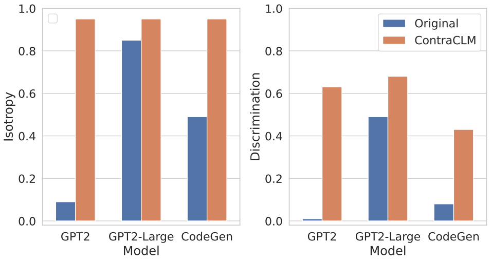

# ContraCLM: Contrastive Learning for Causal Language Model

This repository contains code for the ACL 2023 paper, [ContraCLM: Contrastive Learning for Causal Language Model](https://arxiv.org/abs/2210.01185). 

Work done by: Nihal Jain*, Dejiao Zhang*, Wasi Uddin Ahmad*, Zijian Wang, Feng Nan, Xiaopeng Li, Ming Tan, Ramesh Nallapati, Baishakhi Ray, Parminder Bhatia, Xiaofei Ma, Bing Xiang. (* <em>indicates equal contribution</em>). 

## Updates

* [07-08-2023] Initial release of the code.

## Quick Links

* [Overview](#overview)
* [Setup](#setup)
   * [Environment](#environment)
   * [Datasets](#datasets)
* [Pretraining](#pretraining)
   * [GPT2](#pretain-gpt2-on-nl-data)
   * [CodeGen](#pretrain-codegen-350m-mono-on-pl-data)
* [Evaluation](#evaluation)
* [Citation](#citation)

## Overview

<p align="center">
</img>
</p>

We present ContraCLM, a novel contrastive learning framework which operates at both the token-level and sequence-level. ContraCLM enhances  the discrimination of representations from a decoder-only language model and bridges the gap with encoder-only models, making causal language models better suited for tasks beyond language generation. We encourage you to check out our [paper](https://arxiv.org/abs/2210.01185) for more details.

## Setup

The setup involves installing the necessary dependencies in an environment and placing the datasets in the requisite directory.

### Environment

Run these commands to create a new conda environment and install the required packages for this repository.

```bash
# create a new conda environment with python >= 3.8
conda create -n contraclm python=3.8.12

# install dependencies within the environment
conda activate contraclm
pip install -r requirements.txt
```

### Datasets & Preprocessing

See <a href="preprocess/">here</a>.

## Pretraining

In this section, we show how to use this repository to pretrain (i) `GPT2` on Natural Language (NL) data, and (ii) `CodeGen-350M-Mono` on Programming Language (PL) data.

### Common Instructions

1. This section assumes that you have the train and validation data stored at `TRAIN_DIR` and `VALID_DIR` respectively, and are within an environment with all the above dependencies installed (see [Setup](#setup)).

2. You can get an overview of all the flags associated with pretraining by running:
```bash
python pl_trainer.py --help
```

### Pretain `GPT2` on NL Data

#### Usage

```bash runscripts/run_wikitext.sh```
   1. For quickly testing the code and debug, suggesting run the code with MLE loss only 
   by setting ```CL_Config=$(eval echo ${options[1]})``` within the script. 
   2. All other opotions involves CL loss at either token-level or sequence-level. 

### Pretrain `CodeGen-350M-Mono` on PL Data

#### Usage

1. Configure the variables at the top of `runscripts/run_code.sh`. There are lots of options but only the dropout options are explained here (others are self-explanatory):

   * `dropout_p`: The dropout probability value used in `torch.nn.Dropout`
 
   * `dropout_layers`: If > 0, this will activate the last `dropout_layers` with probability `dropout_p`

   * `functional_dropout`: If specified, will use a functional dropout layer on top of the token representations output from the CodeGen model

 2. Set the variable `CL` according to desired model configuration. Make sure the paths to `TRAIN_DIR, VALID_DIR` are set as desired.

 3. Run the command: `bash runscripts/run_code.sh`

## Evaluation

See the relevant task-specific directories [here](evaluation/).

## Citation

If you use our code in your research, please cite our work as:

```
@inproceedings{jain2023contraclm,
  title={CONTRACLM: Contrastive Learning For Causal Language Model},
  author={Jain, Nihal and Zhang, Dejiao and Ahmad, Wasi Uddin and Wang, Zijian and Nan, Feng and Li, Xiaopeng and Tan, Ming and Nallapati, Ramesh and Ray, Baishakhi and Bhatia, Parminder and others},
  booktitle={Proceedings of the 61st Annual Meeting of the Association for Computational Linguistics},
  year={2023}
}
```

## Security

See [CONTRIBUTING](CONTRIBUTING.md#security-issue-notifications) for more information.

## License

This project is licensed under the Apache-2.0 License.
